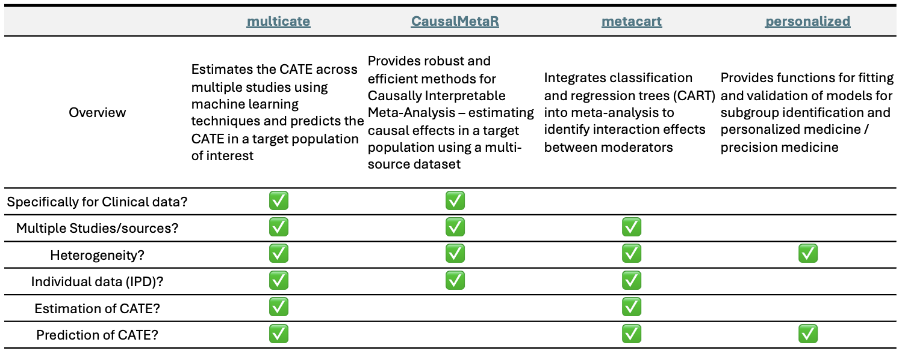

```{r setup, echo=FALSE, message=FALSE, warning=FALSE}
knitr::opts_chunk$set(collapse = TRUE, comment = "#>")
options(tibble.print_min = 4, tibble.print_max = 4)
#install.packages("devtools")
#install.packages("knitr")
#install.packages("usethis")

#1) Key package
#install.packages("pak")
#pak::pak("dobengjhu/multicate")
#library(multicate)

#2) Additional packages for data cleansing
#library(tibble)
#install.packages("tableone")
#library(tableone)
#library(tidyverse)
#install.packages("fastDummies")  # if not already installed
#library(fastDummies)
#install.packages("kableExtra")
#library(kableExtra)
#install.packages("performance")
#library(performance)

#https://www.geeksforgeeks.org/how-to-make-an-r-package-vignette/
#https://bookdown.org/yihui/rmarkdown-cookbook/package-vignette.html
#%\ is also fine rather than \\, {knitr::rmarkdown} is also fine.
```

This guide provides an introduction to the `multicate` package -- an R package for estimation and prediction of heterogeneous treatment effects across one or more studies. The background below is further outlined in the Brantner et al., 2024 paper entitled *Comparison of methods that combine multiple randomized trials to estimate heterogeneous treatment effects*.[^1] The package can be found [here](https://github.com/dobengjhu/multicate).

[^1]: Brantner, C. L., Nguyen, T. Q., Tang, T., Zhao, C., Hong, H., & Stuart, E. A. (2024). Comparison of methods that combine multiple randomized trials to estimate heterogeneous treatment effects. Statistics in medicine, 43(7), 1291-1314. <https://onlinelibrary.wiley.com/doi/abs/10.1002/sim.9955>

 

# Purpose of `multicate`

Randomized controlled trials (RCTs) are considered the gold standard for unbiased estimation of treatment effects. However, RCTs often have limited power to detect heterogeneous treatment effects (HTE) due to sample size constraints, and they may not reflect populations to which findings will be applied. To address these limitations, researchers have developed various methods to combine data from multiple RCTs to improve treatment effect estimation, including approaches such as meta-analysis. However, these techniques often do not explicitly target conditional average treatment effects and typically rely on aggregate-level data, making it challenging to estimate treatment effects conditional on individual-level characteristics.

Enter `multicate`. The `multicate` package implements methodologies that combine multiple studies using individual, patient-level data (IPD). The focal *estimand* in this package is the conditional average treatment effect (CATE), defined under Rubin's potential outcomes framework.[^2] We define $A$ to represent a binary treatment indicator, $S$ a categorical variable for the trial in which the individual participated (from 1 to $K$, with a total of $K$ RCTs), $\textbf{X}$ the covariates, and $Y$ a continuous outcome. Then, we let $Y(0)$ and $Y(1)$ be the potential outcomes under control and treatment, respectively. Generally, the CATE is defined as the expected difference in the potential outcomes under treatment versus control, *conditional on covariates,* $\textbf{X}$:$$\tau(\textbf{X})=E(Y(1)|\textbf{X})-E(Y(0)|\textbf{X})$$

[^2]: Rubin, D. B. (1974). Estimating causal effects of treatments in randomized and nonrandomized studies. Journal of educational Psychology, 66(5), 688. <https://psycnet.apa.org/record/1975-06502-001>

We can also conceptualize the CATE as conditional not only on covariates, but also on study membership, where differences in the treatment effect due to study membership may reflect differences in the distributions of unobserved effect moderators. Here, the CATE can be expressed as $$\tau_{S}(\textbf{X}) = E(Y(1)|\textbf{X}, S)-E(Y(0)|\textbf{X}, S)$$ The `multicate` package can estimates either of these CATE expressions, depending on the specific estimation (or prediction) technique chosen. Notably, while the methods in `multicate` were originally developed to target CATE estimation across multiple RCTs, they can also be utilized in non-experimental studies. We elaborate upon this in the sections to follow.

 

# Features of `multicate`

The `multicate` package enables researchers to combine multiple RCTs to estimate the CATE using various estimation and aggregation methods, while effectively handling heterogeneity in the data. This approach not only increases statistical power but also extends findings from a single study to multiple studies, providing a more robust foundation for personalized decision-making in diverse populations.

-   **Goal:** Guide treatment decision-making in a health care or other practical setting by estimating heterogeneous treatment effects

-   **Data:** multiple RCTs (or other studies), as well as optionally a new target population

-   **Key features:**

    -   *Estimation* of CATEs with different combinations of estimation and aggregation methods

    -   *Visualization* of CATEs and relevant models

    -   *Prediction* of CATEs for a target population

`multicate` incorporates (1) estimation across multiple studies, (2) estimation of the CATE (beyond the overall average treatment effect), (3) visualizations to increase interpretability of machine learning methods for CATE estimation, and (4) prediction techniques for predicting the CATE in a new target population.

Compared to other packages that more focus primarily on meta-analysis, `multicate` is unique in that it is specially designed to estimate the CATE by combining multiple studies and predict CATEs in a target population of interest. The aim of this package is to make informed decisions on which treatment may be preferable for a set covariate profiles – profiles of patients defined based on their characteristics. To our knowledge, no other R package currently supports both estimation and prediction of CATEs specifically when combining studies with machine learning methods. A more detailed explanation of the methods, their contributions and limitations is provided in Brantner et al. (2024).[^3]

[^3]: Brantner, C. L., Nguyen, T. Q., Tang, T., Zhao, C., Hong, H., & Stuart, E. A. (2024). Comparison of methods that combine multiple randomized trials to estimate heterogeneous treatment effects. Statistics in medicine, 43(7), 1291-1314. <https://onlinelibrary.wiley.com/doi/abs/10.1002/sim.9955>



 

# Process of `multicate`: Estimation

`multicate` relies on two primary functions, `estimate_cate()` and `predict()`. They do exactly what you'd expect - estimate and predict the CATE, respectively. Below displays a potential workflow for a two-step approach to use `multicate`. Notably, researchers do not have to proceed to Step 2 - often a goal is solely focused on estimation of the CATE across multiple studies (Step 1).

{width="550px" height="300px"}

## Assumptions

Estimating the CATE across multiple trials rely on a few key assumptions. These include the Stable Unit Treatment Value Assumption (SUTVA), unconfoundedness, consistency, and positivity.

1.  **Stable Unit Treatment Value Assumption (SUTVA)**
2.  **Unconfoundedness of each study:** $Y(0), Y(1) \perp A \mid \textbf{X}$
3.  **Consistency in each study:** $Y = AY(1) + (1-A)Y(0)$ almost surely
4.  **Positivity of treatment assignment in each study:** There exists a constant $b>0$ such that $b < P(A = 1|\textbf{X}) < 1-b$ for all $\textbf{X}$
5.  **Positivity of study membership:** There exists a constant $c>0$ such that $c < P(S=s|\textbf{X})<1-c$ for all $\textbf{X}$ and $s$.

Unconfoundedness and positivity of treatment assignment are met by design in an RCT, and they can be evaluated in observational studies. Assumption 5, which requires that any covariate $\textbf{X}$ is possible to be observed in all studies, may be relaxed depending on the estimation method used.

When `multicate` is used for predicting the CATE in a target population, we rely on estimation of the CATE first, using the same above assumptions as above. Our only addition is;

6.  **Positivity of target population:** There exists a constant $d>0$ such that $d < P(S=s|\textbf{X})<1-d$ for all $\textbf{X}$ *in the target population* and for all $s$. 

Now to estimate CATEs across multiple studies, we rely on both *estimation* and *aggregation* methods. The *estimation* method is the approach originally geared towards CATE estimation in a single study. The *aggregation* method is the approach that extends the application to multiple studies at once. `multicate` is currently set up to implement one of multiple options for both estimation and aggregation.

## Estimation Methods

When the goal is estimation of the CATE, real-world clinical data often involve complex structures that violate parametric assumptions. Unlike parametric models that require pre-specification of effect moderators and distributional assumptions, nonparametric methods offer greater flexibility, especially in modeling nonlinear relationships between covariates and treatment effects. `multicate` is set up to apply non-parametric estimation methods to get the CATE using the `estimate_cate()` function.

### 1) S-learner

The S-learner is a 'meta-learner' in that it combines base learners of different forms in a special way, and we use this learner to estimate a conditional outcome mean function given observed covariates and assigned treatment as $\mu(X,A) = E(Y|X,A)$. Then by plugging in 0 and 1 for $A$, we can obtain predicted outcomes under treatment and control for each individual and calculate $$\hat{\tau} = \hat{\mu} (X,1) - \hat{\mu} (X,0)$$. In this package, we applied Bayesian additive regression trees (BART) for this base learner.

### 2) Causal forest

The causal forest is similar to a traditional random forest, but the primary estimand is the treatment effect itself, not the outcome mean function. It recursively partitions covariates to best split based on treatment effect heterogeneity. The treatment effect is estimated as the difference in average outcomes between the treatment and control units within each leaf. In other words, the causal forest is the weighted aggregation of many causal trees.

## Aggregation Methods

This package is especially well-suited for combining multiple studies with various aggregation methods. However, our package also supports settings where individual-level data can be shared across trials.

### 1) No pooling

When trials are too heterogeneous to justify combining information across studies, it may be preferable to estimate effects separately for each trial. In this case, fitting models within each study independently would be most appropriate. Note that this is not technically an 'aggregation approach' since each study is analyzed independently, and no cross-study information is used. You can specify this setting with aggregation_method = "*studyspecific*".

### 2) Pooling with trial indicator

A 'complete pooling approach' - combining all data and treating it as a single study - requires strong assumptions. To relax these, our package implements 'pooling with a trial indicator'. Basically, all of the individual data from all RCTs is combined into one comprehensive dataset, but a categorical study variable is included. This allows researchers to apply single-study approaches while accounting for full covariates including membership indicator. This will yield trial-specific CATE estimates. You can use aggregation_method = "*studyindicator*" to apply this method.

### 3) Ensemble forest method

This method is based on Tan and colleagues' methods[^4] for federated learning, devised for scenarios in which individual data cannot be shared across trial sites. First, it builds localized models for CATE within each trial, and then applies these models to all individual in all studies to get each individual trial-specific CATE estimates. Then, an ensemble model is trained using these estimates as the response variable, with individual covariates and trial indicators as predictors. This method can be selected with aggregation_method = "*ensembleforest*".

[^4]: Tan, X., Chang, C. C. H., Zhou, L., & Tang, L. (2022, June). A tree-based model averaging approach for personalized treatment effect estimation from heterogeneous data sources. In International Conference on Machine Learning (pp. 21013-21036). PMLR. <https://proceedings.mlr.press/v162/tan22a.html>

 

# Process of `multicate`: Prediction

Once we have estimated the CATE, a unique feature of the `multicate` package is its ability to predict CATEs for a target population — such as a new group of patients at baseline in a healthcare system — using models trained on multiple studies. This is particularly useful when models trained on previously conducted studies need to be applied to individuals outside of the original study samples, such as patients from electronic health records (EHR). When multiple studies involve the same treatment options, you can use this package to apply fitted models to these external individuals and guide real-world treatment decisions.

To predict the CATE, we can use the `predict()` functionality applied to an object resulting from `estimate_cate()`. Applying the function to this object alongside a new target setting dataset will yield prediction intervals for CATEs in the new target setting. In predicting the CATE, we leverage prediction interval techniques from two-stage meta-analysis. Briefly, the approach involves two stages:

1.  **Stage 1:** Estimating the CATE in each study separately (using `estimate_cate()` with `aggregation_method = "studyspecific"`).

2.  **Stage 2:** Summarizing aggregate CATE estimates across studies in a meta-analysis.

From this meta-analysis, we can form prediction intervals around the inverse variance-weighted CATE for a particular covariate profile, estimating the within-study variance from Stage 1 and the between-study variance using restricted maximum likelihood estimation (REML). We replicate the second stage and fit a meta-analysis for every covariate profile $(\textbf{X*})$ of interest in the target setting data to form prediction intervals for each $\tau(\textbf{X*})$.

 

# Q&A

We will finish off this introductory vignette with some common questions about `multicate`.

[**Question 1:** What type of studies can I use in `estimate_cate()`? How does the package handle observational studies?]{.underline}

You can estimate the CATE using any combination of RCTs and/or observational studies. Notably, the prior simulation work assessing performance of these methods in multiple studies has focused on the use of RCTs. However, the estimation methods of `multicate` (S-learner with BART, causal forest) can inherently handle confounding in treatment assignment, and users can allow the methods to automatically address this confounding. If desired, propensity scores can be separately estimated and included in one of two ways: as a covariate for S-learner with BART, or as the `W.hat` argument in the causal forest (see `grf` documentation).

If you are using just a set of observational studies or combining observational studies with RCTs, exercise caution in implementing the aggregation methods that involve pooling or ensembling (see **Question 2** for more on assumptions). It is important to check assumptions and to ensure that the studies are comparable enough that combining data is reasonable.

[**Question 2:** How do I pick which estimation and aggregation method to use?]{.underline}

The answer to this question is somewhat subjective and still in need of future work to verify. When it comes to estimation methods, both the S-Learner with BART and the Causal Forest have been shown to perform well in previous simulations (cite Kunzel paper and Brantner et al 2024). In Kunzel's paper, the S-Learner was shown to sometimes be biased towards 0, and they recommend using the method if the CATE is hypothesized to be in many instances 0. Otherwise though, either approach can be utilized, and both can be compared to assess sensitivity of results.

For the aggregation method, all three have also been shown to perform well in simulations (cite Brantner et al 2024 paper). We recommend three major factors to consider when deciding which aggregation method to use:

1.  **Assumptions:** Assumptions 1-4 above are required for all aggregation methods, but Assumption 5 (positivity of study membership) can be relaxed depending on the approach. Specifically, we do not require that all covariate profiles can be found in all studies for "studyspecific" or "studyindicator", but we do require this assumption for "ensembleforest" since in "ensembleforest", each study's model is applied to all participants across all studies. Therefore, if you have studies without strong overlap in the covariate distributions, you will want to avoid "ensembleforest".

2.  **Pooling data:** Your a priori hypotheses for your data and the variability of the CATE across studies can help inform your model selection. If your studies are very heterogeneous in their covariate distributions and in their hypothesized treatment effects (and treatment effect heterogeneity), it might make sense to not pool the data whatsoever (the "studyspecific" aggregation method). However, the other two aggregation methods allow for some pooling but still pick up on study-level heterogeneity, so for many estimation goals, they will be effective. Of those two methods, the "ensembleforest" method is the most computationally intensive without a notable benefit in simulations over the "studyindicator" technique. But if you are particularly interested in fitting study-specific models before doing any pooling, that is the approach taken by the "ensembleforest".

3.  **Prediction:** If the main goal of your use of `multicate` is to predict the CATEs for a target population, you should use the "studyspecific" aggregation method. This is what is required for use of the `predict()` functionality because it applies a two-stage meta-analysis, where the first stage requires estimation of the CATE within each trial on its own. You can always explore the other aggregation approaches within your estimation first, but ultimately you will rely on "studyspecific" in the prediction step.

[**Question 3:** When should I use the `predict()` functionality?]{.underline}

The `predict()` functionality is meant for a scenario when you are interested in predicting CATEs on a group who is distinct from the original studies that you have complete data on. Often, we may be interested in predicting patients or units at baseline - in this scenario, we can rely on the previously conducted studies to estimate the CATE, and we can predict in our new patients without having seen any treatment or outcomes.

An ideal use case of the prediction would be: using previously conducted studies, we estimate the CATE and subsequently predict in a set of patient profiles who may receive one of two interventions. Using our predictions, we can inform our intervention decision-making in these patients in a more personalized manner (since we are using the CATE as opposed to the ATE), and without relying on them trying the interventions in advance.

[**Question 4:** What kind of visualizations does `multicate` provide?]{.underline}

For Kyungeun to fill in, noting that we will elaborate upon them and show an example in the next section.

[**Question 5:** What packages does `multicate` rely on?]{.underline}

For Kyungeun and/or Daniel to fill in.

 

# Next Up:

If you are ready to try implementing `multicate`, please see our next vignette here.
