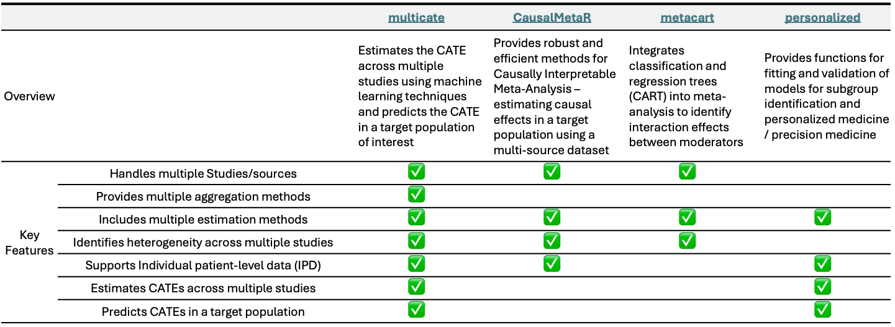
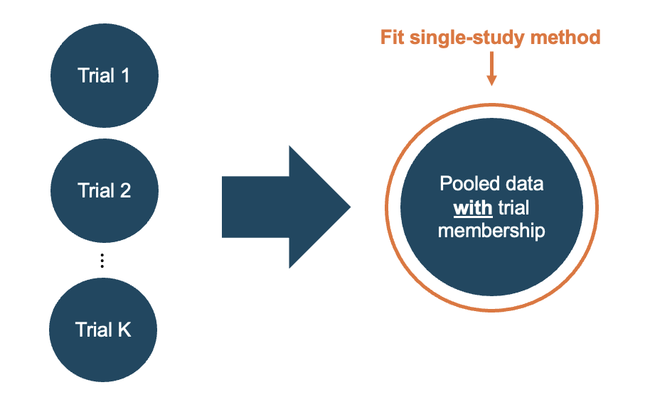
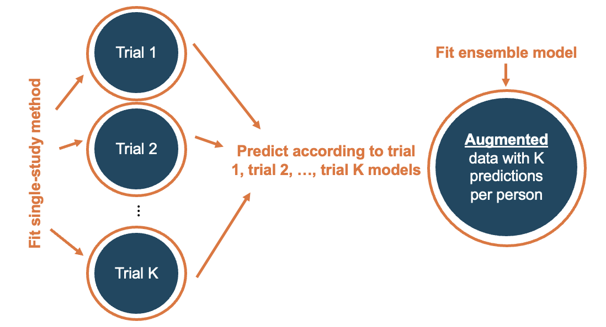

```{r setup, echo=FALSE, message=FALSE, warning=FALSE}
knitr::opts_chunk$set(collapse = TRUE, comment = "#>")
options(tibble.print_min = 4, tibble.print_max = 4)
#install.packages("devtools")
#install.packages("knitr")
#install.packages("usethis")

#1) Key package
#install.packages("pak")
#pak::pak("dobengjhu/multicate")
#library(multicate)

#2) Additional packages for data cleansing
#library(tibble)
#install.packages("tableone")
#library(tableone)
#library(tidyverse)
#install.packages("fastDummies")  # if not already installed
#library(fastDummies)
#install.packages("kableExtra")
#library(kableExtra)
#install.packages("performance")
#library(performance)

#https://www.geeksforgeeks.org/how-to-make-an-r-package-vignette/
#https://bookdown.org/yihui/rmarkdown-cookbook/package-vignette.html
#%\ is also fine rather than \\, {knitr::rmarkdown} is also fine.
```

This guide provides an introduction to the `multicate` package -- an R package for estimation and prediction of heterogeneous treatment effects across one or more studies. The background below is further outlined in the Brantner et al., 2024 paper entitled *Comparison of methods that combine multiple randomized trials to estimate heterogeneous treatment effects*.[^1] The package can be found [here](https://github.com/dobengjhu/multicate).

[^1]: Brantner, C. L., Nguyen, T. Q., Tang, T., Zhao, C., Hong, H., & Stuart, E. A. (2024). Comparison of methods that combine multiple randomized trials to estimate heterogeneous treatment effects. Statistics in medicine, 43(7), 1291-1314. <https://onlinelibrary.wiley.com/doi/abs/10.1002/sim.9955>

Personalized decisions require understanding how treatment effects vary across patients. A single study often lacks the precision to estimate this heterogeneity. Pooling multiple randomized trials preserves unconfounded treatment assignment, yet cross-trial heterogeneity—driven by observed and unobserved differences in populations, settings, or protocols—can still be substantial. The goal here is not de-biasing one dataset, but quantifying that heterogeneity and accounting for it when estimating treatment effects across trials.

The `multicate` package implements flexible, nonparametric estimators to learn heterogeneous treatment effects across trials, capturing complex, nonlinear covariate–treatment interactions. This tutorial highlights the package's aims and key features, and workflow, and addresses common questions.

 

# Purpose of `multicate`

Randomized controlled trials (RCTs) are the gold standard for unbiased average effects, but often lack power for heterogeneity and may not represent target populations. Combining RCTs via conventional (including random-effects) meta-analysis improves precision, yet estimates overall or study-level subgroup averages from aggregate data. By contrast, CATE methods target effects conditional on individual covariates, using individual-participant data (IPD) and flexible models that capture nonlinearities and interactions. With multiple RCTs, IPD-based CATE approaches retain unconfounded assignment within each trial while explicitly modeling cross-trial heterogeneity, enabling patient-level personalization beyond what standard meta-analysis can provide.

The `multicate` package guides treatment decision-making in a health care or other practical setting by estimating heterogeneous treatment effects. It implements methods that combine multiple studies using individual, patient-level data. The focal *estimand* in this package is the conditional average treatment effect (CATE), defined under Rubin's potential outcomes framework.[^2] We define $A$ to represent a binary treatment indicator, $S$ a categorical variable for the trial in which the individual participated (from 1 to $K$, with a total of $K$ studies), $\textbf{X}$ the covariates, and $Y$ a continuous outcome. Then, we let $Y(0)$ and $Y(1)$ be the potential outcomes under control and treatment, respectively. Generally, the CATE is defined as the expected difference in the potential outcomes under treatment versus control, *conditional on covariates,* $\textbf{X's}$:$$\tau(\textbf{X})=E(Y(1)-E(Y(0)|\textbf{X})$$

[^2]: Rubin, D. B. (1974). Estimating causal effects of treatments in randomized and nonrandomized studies. Journal of Educational Psychology, 66(5), 688. <https://psycnet.apa.org/record/1975-06502-001>

(Note that this comparison of potential outcomes could take a different form, for example, a ratio, for non-continuous outcomes.) We can also conceptualize the CATE as conditional not only on covariates, but also on study membership, where differences in the treatment effect due to study membership may reflect differences in the distributions of unobserved effect moderators. Here, the CATE can be expressed as $$\tau_{S}(\textbf{X}) = E(Y(1)-Y(0)|\textbf{X}, S)$$ The `multicate` package can estimates either of these CATE expressions, depending on the specific estimation (or prediction) technique chosen, discussed further below. Notably, while the methods in `multicate` were originally developed to target CATE estimation across multiple RCTs, they can also be utilized in non-experimental studies. We elaborate upon this in the sections to follow.

 

# Features of `multicate`

`multicate` package enables researchers to combine multiple RCTs to estimate the CATE using various estimation and aggregation methods, while effectively handling heterogeneity in the data. The workflow has two steps: (1) estimate CATE across studies, and (2) aggregate across studies to combine information across studies. This package also provides visualization tools to interpret CATE estimates, and functions to predict CATE to a new target population.

Compared to other packages [^3] [^4] [^5] that primarily focus on aggregate-data meta-analysis, `multicate` is purpose-built for individual-level CATE estimation from multiple studies and predicting CATE in a target population. With a single package, you can estimate patient-level CATEs from pooled RCTs and obtain target-population predictions, streamlining multi-trial exploratory analyses. See the table below for how `multicate` differs from other existing packages.

[^3]: CausalMetaR CRAN manual <https://cran.r-project.org/web/packages/CausalMetaR/index.html>

[^4]: metacart CRAN manual <https://cran.r-project.org/web/packages/metacart/index.html>

[^5]: personalized CRAN manual <https://cran.r-project.org/web/packages/personalized/index.html>



 

# Process of `multicate`: Estimation

Estimate CATEs with `estimate_cate()`, then generate prediction using the S3 `predict()` method on the fitted object by `estimate_cate()`. The figure below outlines the package's workflow: train a set of RCTs, and then optionally predict CATEs for a separate target population.

{width="1000px" height="300px"}

## Assumptions

Estimating the CATE across multiple trials relies on a few key assumptions.

1.  **Stable Unit Treatment Value Assumption (SUTVA)**: Each person’s outcome depends only on their own treatment (no spillovers), and “treatment” and “control” are well-defined single versions.
2.  **Unconfoundedness of each study:** $Y(0), Y(1) \perp A \mid \textbf{X}$. After accounting for covariates $X's$, who gets treated is as good as random with respect to the outcomes they would have under either treatment.
3.  **Consistency in each study:** $Y = AY(1) + (1-A)Y(0)$ almost surely. The observed outcome equals the potential outcome for the treatment actually received (i.e., no hidden or mismatched versions of treatment).
4.  **Positivity of treatment assignment in each study:** There exists a constant $b>0$ such that $b < P(A = 1|\textbf{X}) < 1-b$ for all $\textbf{X}$. Every covariate profile has a nonzero chance of receiving each treatment; no one is deterministically treated or untreated.
5.  **Positivity of study membership:** There exists a constant $c>0$ such that $c < P(S=s|\textbf{X})<1-c$ for all $\textbf{X}$ and $s$. For any covariate profile, inclusion in each study (or target population) has a nonzero probability, ensuring overlapping covariate support across studies.

When `multicate` is used for predicting the CATE in a target population, we must additionally assume:

6.  **Positivity of target population:** There exists a constant $d>0$ such that $d < P(S=s|\textbf{X})<1-d$ for all $\textbf{X}$ *in the target population* and for all $s$. In the target population, no covariate profile is deterministically excluded from any study—every type of person has some chance of appearing in each study—so the trials collectively cover the target’s covariate support for transportability.

More detailed assumptions and explanations can be found in Brantner et al., 2024 paper.[^1]


## Estimation Methods

Real-world clinical data often involve complex structures that violate parametric assumptions. `multiacate` offers two non-parametric methods, S-learner and Causal forest. Non-parametric methods can be particularly useful because they offer greater flexibility, especially in modeling nonlinear relationships between covariates and treatment effects. `multicate` is set up to apply non-parametric estimation methods to get the CATE using the `estimate_cate()` function.

### 1) S-learner

The S-learner is a 'meta-learner' in that it combines a base learner - any supervised model used to predict $Y$ (e.g., linear/logistic regression, random forests, gradient boosting, neural nets) - and uses it in a special way: it fits a single model for the conditional outcome $\mu(X,A) = E(Y(A)|X)$, treating the treatment $A$ as just another feature so the model can learn $A$ x $X$ interactions[^6]. By holding $X$ fixed and plugging in 0 and 1 for $A$, we can obtain $\hat{\mu} (X,1)$ and $\hat{\mu} (X,0)$ for each individual, and compute the CATE as $$\hat{\tau} = \hat{\mu} (X,1) - \hat{\mu} (X,0).$$

BART, introduced by Chipman et al. (2007, 2010), is a Bayesian nonparametric model that combines a sum of trees approach with regularization priors. [^7] [^8] [^9] These priors regularize toward additive structure to mitigate overfitting and provide posterior draws of outcomes from which credible intervals can be constructed. The S-learner framework overall can incorporate various algorithms (e.g., random forests, neural networks); however, `multicate` specifically uses BART for its flexibility and performance in estimating treatment effect heterogeneity. More technical details and parameter settings can be found in Sparapani et al. (2021) [^10]. You can select the S-learner with BART method by setting `estimation method = "slearner"`.

[^6]: Künzel, S. R., Sekhon, J. S., Bickel, P. J., & Yu, B. (2019). Metalearners for estimating heterogeneous treatment effects using machine learning. Proceedings of the national academy of sciences, 116(10), 4156-4165. <https://doi.org/10.1073/pnas.1804597116>

[^7]: Chipman, H. A., George, E. I., & McCulloch, R. E. (2010). BART: Bayesian additive regression trees. <https://doi.org/10.1214/09-AOAS285>

[^8]: Hill, J., Linero, A., & Murray, J. (2020). Bayesian additive regression trees: A review and look forward. Annual Review of Statistics and Its Application, 7(1), 251-278. <https://doi.org/10.1146/annurev-statistics-031219-041110>

[^9]: Hill, J. L. (2011). Bayesian nonparametric modeling for causal inference. Journal of Computational and Graphical Statistics, 20(1), 217-240. <https://doi.org/10.1198/jcgs.2010.08162>

[^10]: Sparapani, R., Spanbauer, C., & McCulloch, R. (2021). Nonparametric machine learning and efficient computation with Bayesian additive regression trees: The BART R package. Journal of Statistical Software, 97, 1-66. <https://www.jstatsoft.org/article/view/v097i01>


### 2) Causal forest

The causal forest is similar to a traditional random forest, but the primary quantity the trees are split based on is the treatment effect itself, not the outcome mean function. In particular, causal forests recursively partitions the covariates to best split based on treatment effect heterogeneity. The treatment effect within each leaf is estimated as the difference in average outcomes between the treatment and control units that fall in the given leaf. In other words, the causal forest is the weighted aggregation of many causal trees.[^11] This approach can be selected by setting `estimation_method = "causalforest"`. 

[^11]: Athey, S., Tibshirani, J., & Wager, S. (2019). Generalized random forests. <https://www.jstor.org/stable/26581894>


## Aggregation Methods


### 1) Pooling with trial indicator

A "complete pooling approach" - combining all data and treating it as a single study - requires strong assumptions. To relax these, our package implements pooling with a trial indicator. Under this strategy, all of the individual data from all RCTs is combined into one comprehensive dataset, but a categorical study variable is included. This allows researchers to apply single-study estimation approaches while accounting for full covariates including membership indicator. This will yield CATE estimates that are conditional on not only covariates, but also study membership. You can use `aggregation_method = "studyindicator"` to apply this method.

{width="450px" height="270px"}

### 2) Ensemble forest method

This method is based on Tan and colleagues' methods[^12] for federated learning, devised for scenarios in which individual data cannot be shared across trials. First, it builds localized models for CATE within each study, and then applies these models to all individuals in all studies to estimate the CATE for each individual based on the CATE model from each study. An ensemble model is then trained using these estimates as the response variable, with individual covariates and trial indicators as predictors. This approach also yields CATE estimates that are conditional on both covariates and study membership. This method can be selected with `aggregation_method = "ensembleforest"`.

{width="550px" height="300px"}


[^12]: Tan, X., Chang, C. C. H., Zhou, L., & Tang, L. (2022, June). A tree-based model averaging approach for personalized treatment effect estimation from heterogeneous data sources. In International Conference on Machine Learning (pp. 21013-21036). PMLR. <https://proceedings.mlr.press/v162/tan22a.html>

### 3) No pooling

When trials are too heterogeneous to justify combining information across studies, it may be preferable to estimate effects separately for each trial. In this case, fitting models within each study independently would be most appropriate. Note that this is not technically an 'aggregation approach' since each study is analyzed independently, and no cross-study information is used. You can specify this setting with aggregation_method = "*studyspecific*".


 

# Process of `multicate`: Prediction

Once we have estimated the CATE, a unique feature of the `multicate` package is its ability to predict CATE for a target population. For example, you can train on multiple trials and then predict CATE for a different group – such as patients entering a health system – to support individualized decisions. This is particularly useful when models trained on previously conducted studies need to be applied to individuals outside the original samples (e.g., patients from electronic health records (EHR) data). When multiple studies involve the same treatment options, you can use this package to apply fitted models to these external individuals and guide real-world treatment decisions.

A requirement for the `multicate` approach to prediction of the CATE is that the estimates should by study-specific CATEs -- specifically, CATEs that are estimated according to one model fit per study (aggregation_method = "studyspecific"). To predict the CATE for a target population, we can supply the object returned by `estimate_cate()` to the `predict()` S3 generic function which will apply `multicate`'s S3 method for CATE prediction, yielding prediction intervals for CATEs in the new target setting. (An S3 generic in R is a standard interface that automatically calls the version of the function designed for your object’s class.)

CATE prediction leverages prediction interval techniques used in two-stage meta-analysis.[^13] Briefly:

1.  **Stage 1:** Estimating the CATE in each study separately, as described above (using `estimate_cate()` with `aggregation_method = "studyspecific"`).

2.  **Stage 2:** Summarizing aggregate CATE estimates across studies in a meta-analysis framework.

From this meta-analysis, we can form prediction intervals around the inverse variance-weighted CATE for a particular covariate profile, estimating the within-study variance from Stage 1 and the between-study variance using restricted maximum likelihood estimation (REML). We replicate the second stage and fit a meta-analysis for every covariate profile $(\textbf{X*})$ of interest in the target setting data to form prediction intervals for each $\tau(\textbf{X*})$.

[^13]: Brantner, C. L., Nguyen, T. Q., Parikh, H., Zhao, C., Hong, H., & Stuart, E. A. (2025). Precision Mental Health: Predicting Heterogeneous Treatment Effects for Depression through Data Integration. arXiv preprint arXiv:2509.04604.
 

# Q&A

[**Question 1:** What type of studies can I use in `estimate_cate()`? How does the package handle observational studies?]{.underline}

You can estimate the CATE using any combination of RCTs and/or observational studies. Notably, the prior simulation work assessing performance of these methods in multiple studies focused on the use of RCTs. However, the estimation methods of `multicate` (S-learner with BART, causal forest) can inherently handle confounding in treatment assignment, and users can allow the methods to automatically address this confounding. If desired, propensity scores can be separately estimated and included in one of two ways: as a covariate for S-learner with BART alongside treatment and other features, or as the `grf::causal_forest(…, W.hat = pihat)` argument in the causal forest (see `grf` documentation).

If you are using just a set of observational studies or combining observational studies with RCTs, exercise caution in implementing the aggregation methods that involve pooling or ensembling (see **Question 2** for more on assumptions). It is important to check assumptions and to ensure that the studies are comparable enough that combining data is reasonable.

[**Question 2:** How do I pick which estimation and aggregation method to use?]{.underline}

The answer to this question is somewhat subjective and still in need of future work to fully answer. When it comes to estimation methods, both the S-Learner with BART and the Causal Forest have been shown to perform well in previous simulations (e.g., Künzel et al., 2019; Brantner et al., 2024) [^6] [^1]. In Künzel et al., (2019), the S-Learner can underestimate CATE's - i.e., produce effects closer to 0 than they should be - because a single outcome model may shrink the treatment signal. They recommend using the method if the CATE is hypothesized to be in many instances 0. Otherwise though, either approach can be utilized, and both can be compared to assess sensitivity of results.

For the aggregation method, all three have also been shown to perform well in simulations (Brantner et al., 2024). We recommend three major factors to consider when deciding which aggregation method to use:

1.  **Assumptions:** Assumptions 1-4 above are required for all aggregation methods, but Assumption 5 (positivity of study membership) can be relaxed depending on the approach. Specifically, studyspecific or studyindicator do not require that all covariate profiles can be found in all studies, but ensembleforest requires this assumption since in ensembleforest, each study’s model is applied to all participants across all studies. Therefore, if you have studies without strong overlap in the covariate distributions, you will likely want to avoid "ensembleforest".

2.  **Pooling data:** Your a priori hypotheses for your data and the variability of the CATEs across studies can help inform your model selection. If your studies are very heterogeneous in their covariate distributions and in their hypothesized treatment effects (and treatment effect heterogeneity), it might make sense to not pool the data whatsoever (the “studyspecific” method). However, the other two aggregation methods allow for some pooling but still pick up on study-level heterogeneity, so for many estimation goals, they will be effective. Of those two methods, the “ensembleforest” method is the most computationally intensive without a notable benefit in simulations over the “studyindicator” technique. But if you are particularly interested in fitting study-specific models before doing any pooling, that is the approach taken by the “ensembleforest”.

3.  **Prediction:** If the main goal of your use of `multicate` is to predict the CATEs for a target population, you should use the "studyspecific" aggregation method. This is what is required for use of the `predict()` functionality because it applies a two-stage meta-analysis, where the first stage requires estimation of the CATE within each trial on its own. You can always explore the other aggregation approaches within your estimation first, but ultimately you will rely on "studyspecific" in the prediction step.

[**Question 3:** When should I use the `predict()` functionality?]{.underline}

The `predict()` functionality is meant for a scenario when you are interested in predicting CATEs for a group who is distinct from the participants in the original studies that you have data on, and for whom you have covariates (X) observed but not treatment or outcomes. 

An ideal use case of the prediction would be: using previously conducted studies, we estimate the CATE and subsequently predict in a set of patient profiles who may receive one of two interventions (e.g., patients in a health system that wants to use the CATE estimates to inform decision-making). 


[**Question 4:** What kind of visualizations does `multicate` provide?]{.underline}

`multicate` provides five types of visualization plots, along with a covariate distribution plot across studies: a histogram of estimated conditional average treatment effects (CATEs), a boxplot of CATEs stratified by study membership, a plot of 95% confidence intervals for all CATEs sorted by their estimated values, a best linear projection (available only when `estimation_method = "causalforest"`), and an interpretation tree. Additionally, a covariate distribution plot across studies highlights how the distribution of a selected covariate varies across different studies. This helps researchers assess the extent of covariate imbalance or heterogeneity between studies.

&nbsp;&nbsp; A. **Histogram of Estimated CATEs** — Shows the overall distribution of CATE estimates, revealing spread, skew, and any modes.

&nbsp;&nbsp; B. **Boxplot of CATEs by Study ID** — Compares CATE distributions across trials, highlighting between-study variation or consistency.

&nbsp;&nbsp; C. **95% CI Plot for All CATEs** — Each point is a CATE estimate with its 95% CI, letting you assess precision and whether effects exclude zero.

&nbsp;&nbsp; D. **Interpretation Tree** — Provides simple if–then rules that partition patients into groups with different average CATEs.

&nbsp;&nbsp; E. **Best Linear Projection** — Summarizes how CATEs relate to covariates (by study) via a parsimonious linear approximation.

&nbsp;&nbsp; F. **Covariate–CATE by Study ID** — The `plot_vteffect()` panel plots CATE against a chosen covariate by study, revealing differences in covariate ranges and effect patterns across trials.

{width="550px" height="300px"}


[**Question 5:** What packages does `multicate` rely on?]{.underline}

`multicate` builds on established R packages depending on the method used: 

- S-learner is implemented using the `dbarts` package. Default setting include: `keeptrees = TRUE`, and `verbose = FALSE` (only when `aggregation_method = "ensembleforest"`.

- Causal forest is based on the `grf` package, using its `causal_forest()` function with defaults: `importance = "impurity"` and `keep.inbag = TRUE`.

For additional details and parameter options, refer to the package documentation. [^14] [^15]

[^14]: dbarts CRAN manual <https://cran.r-project.org/web/packages/dbarts/index.html>

[^15]: grf CRAN manual <https://cran.r-project.org/web/packages/grf/index.html>


[**Question 6:** What covariates should I include as potential moderators?]{.underline}

All pre-treatment variables that you hypothesize may predict either treatment assignment or the outcome should be included as adjustment covariates to satisfy assumptions and address confounding as much as possible. A subset of these covariates, chosen based on subject-matter knowledge, may be potential moderators —- variables that plausibly modify the treatment effect. Typical examples include demographics, baseline severity measures, and comorbidities. Post-treatment variables, mediators, and instruments should be excluded. By including a rich set of adjustment variables and a theory-driven set of moderators, you can more reliably estimate CATEs and uncover meaningful effect heterogeneity.

Notably, with the flexible methods used in this package, all covariates that you include in your set $\boldsymbol{X}$ are treated as potential predictors and used automatically for confounding adjustment and for detecting effect heterogeneity. In other words, you do not have to pre-specify which of the covariates you think may be your moderators and which may just be control variables. So in general, it's a good idea to be relatively inclusive in terms of the variables you put into the model. 

 

# Next Up:

If you are ready to try implementing `multicate`, please see our next vignette here, which walks through a complete analysis using multiple trials and a target population for CATE prediction.

